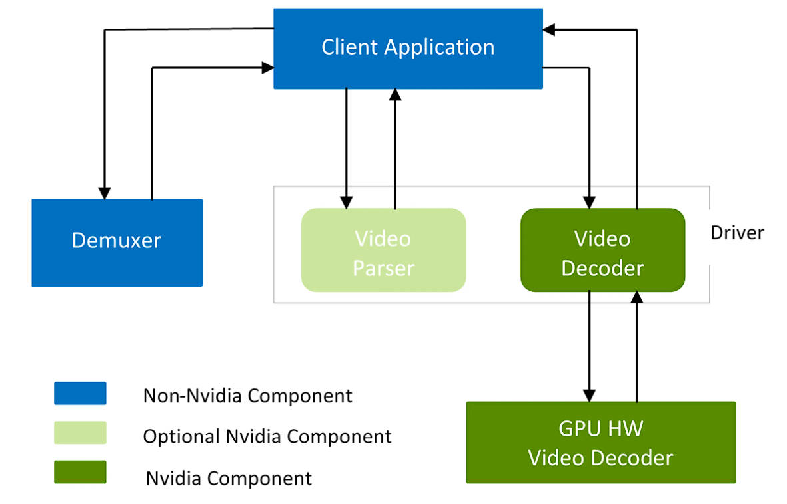

Forked from: 手写AI: hard_decode_trt

操作系统：ubuntu2204
1. 安装bazel(7.0)
到[链接](https://mirrors.huaweicloud.com/bazel/7.0.0/)下载bazel可执行文件bazel-7.0.0-linux-x86_64
将bazel-7.0.0-linux-x86_64可执行文件改名为bazel并将其放在/usr/bin目录下
```bash
sudo chmod +x bazel-7.0.0-linux-x86_64
sudo mv bazel-7.0.0-linux-x86_64 /usr/bin/bazel
```

2. 安装ffmpeg(7.0)
```bash
git clone https://github.com/FFmpeg/FFmpeg.git ffmpeg
cd ffmpeg
git checkout n7.0  # 切换到7.0版本的
./configure --prefix=/root/host_container_mapping_dir/container1/hard_decode_trt/ffmpeg-build \
            --enable-shared \
            --disable-static \
            --extra-ldflags=-Wl,-rpath=\$\$ORIGIN/../lib
make ${nproc} install
```

3. 安装opencv(4.9)
```bash
git clone https://github.com/opencv/opencv.git -b 4.9.0
mkdir opencv-build
cd opencv
cmake ..   -DCMAKE_BUILD_TYPE=Release   -DCMAKE_INSTALL_PREFIX=/root/host_container_mapping_dir/container1/hard_decode_trt/opencv-build   -DWITH_FFMPEG=ON   -DOPENCV_FFMPEG_USE_FIND_PACKAGE=OFF   -DFFMPEG_INCLUDE_DIR=/root/host_container_mapping_dir/container1/hard_decode_trt/ffmpeg-build/include   -DFFMPEG_LIB_DIR=/root/host_container_mapping_dir/container1/hard_decode_trt/ffmpeg-build/lib   -DCMAKE_PREFIX_PATH=/root/host_container_mapping_dir/container1/hard_decode_trt/ffmpeg-build   -DCMAKE_EXE_LINKER_FLAGS="-L/root/host_container_mapping_dir/container1/hard_decode_trt/ffmpeg-build/lib -lswresample"
make -j$(nproc) install
```

4. 下载Video Codec SDK(13.0)
下载[Codec SDK](https://docs.nvidia.com/video-technologies/video-codec-sdk/13.0/read-me/index.html)放置在当前目录下

5. 英伟达显卡解码单元架构
参考链接：https://docs.nvidia.com/video-technologies/video-codec-sdk/12.1/nvdec-video-decoder-api-prog-guide/index.html?utm_source=chatgpt.com


6. 英伟达硬解码流程
* 创建CUDA上下文。
* 查询硬件解码器的解码能力。
* 创建解码器实例。
* 解复用内容（如.mp4文件）。此步骤可通过FFmpeg等第三方软件完成。
* 使用NVDECODE API提供的解析器或第三方解析器（如FFmpeg）解析视频比特流。
* 通过NVDECODE API启动解码。
* 获取解码后的YUV数据以供后续处理。
* 查询已解码帧的状态。
* 根据解码状态，将解码输出用于后续处理（如渲染、推理、后处理等）。
* 如果应用程序需要显示输出：
    * 将解码后的YUV表面转换为RGBA格式。
    * 将RGBA表面映射到DirectX或OpenGL纹理。
    * 将纹理绘制到屏幕上。
* 解码完成后销毁解码器实例。
* 销毁CUDA上下文。

7. 项目流程图
见工程下的flowchart.drawio

**注意：** Video_Codec_SDK_13.0.19/Lib中的库（libnvcuvid.so和libnvidia-encode.so）只是“存根”库，只是保证编译时可以通过，实际上运行时并不链接到该库，而是链接到/usr/lib/x86_64-linux-gnu/libnvcuvid.so和/usr/lib/x86_64-linux-gnu/libnvidia-encode.so，而这两个库是安装nvidia驱动的时候自动
安装的，因此该项目一定要在宿主机中运行
[参考链接](https://forums.developer.nvidia.com/t/video-codec-sdk-not-work/111576/3?u=kungedefaxing)


Q: 在网络传输中，由于乱序、丢包、重传等原因，视频流数据包到达的顺序可能是乱序，在使用英伟达硬解码的过程中怎么保证，解码出的图片和原视频源顺序一致
A: FFmpeg自动处理：FFmpeg解复用器内部会缓冲和重新排序数据包，即使网络传输中包乱序，FFmpeg会尽量按正确顺序输出给解码器；
NVIDIA CUVID解码器自动重排序：CUVID解码器理解视频编码的复杂性（如B帧），自动处理解码顺序和显示顺序的差异，内部维护正确的帧显示顺序
